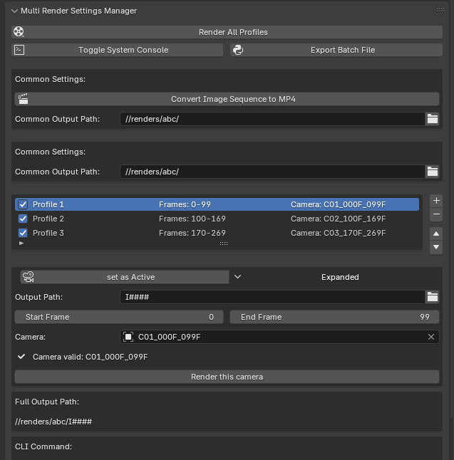

# Multi Render Settings Manager - 機能解説と操作説明

## 機能概要

このアドオンは、Blenderで複数のレンダリング設定（カメラ、フレーム範囲、出力パスなど）を「プロファイル」として管理し、バッチファイルとして書き出します。
最低限の機能の実装のため、シーンやレイヤーを選択したりなどはできません。
 
## 主な機能

1. **複数のレンダリングプロファイル管理**：異なるカメラ、フレーム範囲、出力先を持つ複数のレンダリング設定を保存・管理
2. **バッチレンダリング**：有効化されたプロファイルを連続して自動レンダリング
3. **バッチファイル書き出し**：コマンドライン実行用のバッチファイル(.batまたは.sh)を生成
4. **共通出力パス設定**：すべてのプロファイルに適用される基本出力パスの設定

## 基本的な使い方
- パネルの場所
- プロパティパネル > 出力(Output) タブ > MP4 Conversion セクション

## Blenderでのインストール:

Blenderを起動します
- メニューから 編集(Edit) > 環境設定(Preferences) を選択します
- アドオン(Add-ons) タブをクリックします
- 画面右上の インストール(Install) ボタンをクリックします
- ダウンロードした.zipファイル(.pyファイル)を選択し、アドオンをインストール(Install Add-on) をクリックします

## アドオンの有効化:

- インストールしたアドオンを検索ウィンドウで検索します（「MP4」や「Conversion」などで検索）
- アドオン名の左側にあるチェックボックスをオンにして有効化します
- 必要に応じて、アドオンの設定を調整します

### 1. プロファイルの作成と管理

- **プロファイル追加**：「+」ボタンをクリックして新しいプロファイルを追加
- **プロファイル削除**：「-」ボタンでプロファイルを削除
- **プロファイル順序変更**：上下矢印ボタンでプロファイルの順序を変更
- **有効/無効切替**：チェックボックスでプロファイルの有効/無効を切り替え

### 2. プロファイル設定

- **名前設定**：わかりやすい名前を設定
- **出力パス**：レンダリング結果の保存先を指定
- **フレーム範囲**：開始フレームと終了フレームを指定
- **カメラ選択**：使用するカメラを選択
- **カメラ設定**：「Set」ボタンでカメラを現在のアクティブカメラに設定

### 3. レンダリング実行

- **個別レンダリング**：プロファイル詳細内の「Render」ボタンで、そのプロファイルのみレンダリング
- **一括レンダリング**：パネル上部の「Render All Profiles」ボタンで有効なプロファイルをすべて連続レンダリング

### 4. バッチファイル生成

- **バッチファイル作成**：「Export Batch File」ボタンでコマンドライン実行用のバッチファイルを生成
- **システムコンソール表示**：「Toggle System Console」ボタンでコンソールウィンドウの表示/非表示を切り替え（Windowsのみ）

## 便利な使い方

- **共通出力パス**：すべてのプロファイルに共通する基本出力パスを設定し、各プロファイルでは相対パスを指定すると整理しやすい
- **プロファイル展開/折りたたみ**：プロファイル名の横の矢印アイコンで詳細表示を切り替え
- **コマンドライン表示**：プロファイル詳細に表示されるコマンドラインは外部でのレンダリング時に参考になる
